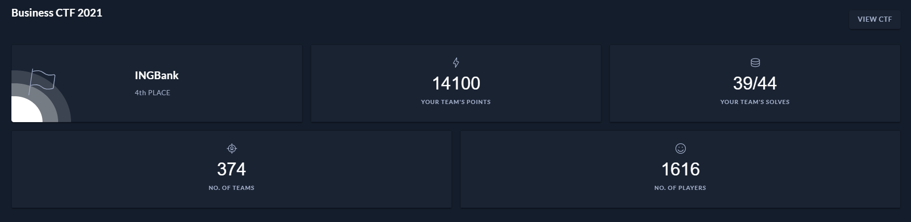

# Hackthebox Business CTF 2021

It started quite random, with me asking within the company if there are any people who are willing to take part in the HackTheBox CTF for companies. I wasn't expecting much, as this was a holiday season. Indeed, only few people repled. We registered last minute, and in the end we had 4 active participants. Despite the small number of participants (limit was 4) our squad was really stron. I dion't even expect how strong. Guys were popping boxes as crazy, and all thet left for me were Reversing and Forensics challenges with some time for Crypto as well.

In the end we managed to take 4th place, even being 2nd for some time during the competition. For me it's a great success and I am greatful to my teammates. In this repo you will find writeups, of challenges I've done (and one I didn't finish)

