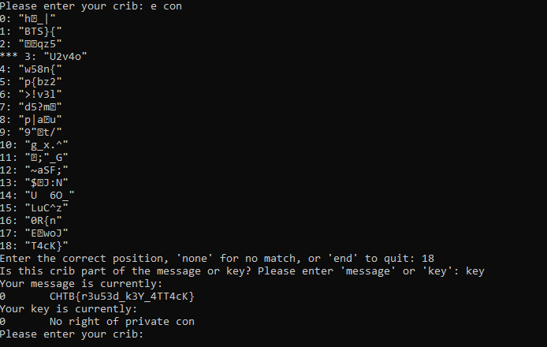

**Description**: The aliens have learned the stupidity of their misunderstanding of Kerckhoffs's principle. Now they're going to use a well-known stream cipher (AES in CTR mode) with a strong key. And they'll happily give us poor humans the source because they're so confident it's secure!

**Stars**: 1/5

**Downloadable**:
output.txt - encrypted file
phasestream3.py - encryption algorithm

**Goal**: To find a vulnerability of the algorithm and decrypt the flag

**Solution**: 

It turns out that most of the Stream Ciphers are vulnerable to a Crib-Dragging attack if you use the same key-nonce pair for multiple (more than 1) payloads. This is exactly a case here where we have a test payload with known plaintext, and the real payload, encrypted with the same key and nonce.

Good article about this here: https://medium.com/@fhbro/crib-dragging-plain-text-attack-5a61a0bcd80d

And a tool I used to recover the flag: https://github.com/SpiderLabs/cribdrag

We first use xorstring.py tool (or any other xor implementation really) to xor both ciphertexts:

```bash
python2 cribdrag/xorstrings.py "464851522838603926f4422a4ca6d81b02f351b454e6f968a324fcc77da30cf979eec57c8675de3bb92f6c21730607066226780a8d4539fcf67f9f5589d150a6c7867140b5a63de2971dc209f480c270882194f288167ed910b64cf627ea6392456fa1b648afd0b239b59652baedc595d4f87634cf7ec4262f8c9581d7f56dc6f836cfe696518ce434ef4616431d4d1b361c" "4b6f25623a2d3b3833a8405557e7e83257d360a054c2ea"
0d27743012155b01155c027f1b41302955203114002413
```

Then we use a cribdrag.py tool to get the first plaintext from the xor by providing the second known plaintext:

