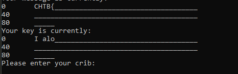
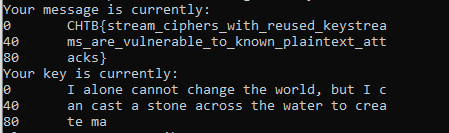

**Description**: The aliens saw us break PhaseStream 3 and have proposed a quick fix to protect their new cipher.

**Stars**: 2/5

**Downloadable**:
output.txt - encrypted file
phasestream4.py - encryption algorithm

**Goal**: To find a vulnerability of the algorithm and decrypt the flag

**Solution**: 

Similar as for [PhaseStream 3](), we need to use same Crib Dragging technique but this time we do not have a plaintext for the first encrypted blob.

We know the flag format of course, if we input as a known plaintext, we will receive first 5 characters of the plaintext used in the first encryption.

From there some googling will take us to this quite from Mother Theresa: "I alone cannot change the world, but I can cast a stone across the waters to create many ripples."

If we use it as a key, we get our flag:

