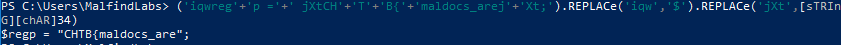
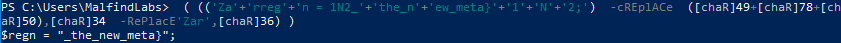

**Description**: -

**Stars**: 1/5

**Downloadable**:
invite.docm - a macro-enabled word document

**Goal**: Given the invite.docx file, get the flag

**Solution**: 

A typical malicious document analysis challenge. I like it because it is quite consistent with what is required to triage malware on everyday basis.

We get a macro-enabled document with a typical lure to enable macros. If we check it with olevba (or directly in Word on isolated VM) we see there's a simple obfuscated VBA code with one deobfuscation routine. Actually olevba already deobfuscates it for us partially, but this is too fragmented so I will use a different method rather than cleaning this up.

My favorite trick is always to ask malware to deobfuscate itself for us. It can safe a lot of time in case of more complex obfuscation scenarios. In this case I add this one line to the code: `ActiveDocument.Content.InsertAfter Text:=odsuozldxufm` and then run a macro again.


It deobfuscates itself into the document!


We can see it's base64 encoded. We can decode it in CyberChef or any other favorite decoder. It is indeed an encoded powershell command. Looks like it contains another base64 encoded payload that it tries to install persistently in `"HKCU:\Software\$($regp)" -Name "$($regn)"` as a Scheduled Task. The payload itself connects to a different IP over port 4444 and tries to download and execute additional code (Please see powershell.ps1 file to see entire payload).

This part is not really important for the CTF challenge, and only shows typical Malware TTPs for educational purposes.

For us important are two slightly obfuscated lines:

```powershell
. ( $PshomE[4]+$pshoMe[30]+'x') ( [strinG]::join('' , ([REGeX]::MaTCHES( ")'x'+]31[DIlLeHs$+]1[DiLLehs$ (&| )43]RAhc[]GnIRTs[,'tXj'(eCALPER.)'$','wqi'(eCALPER.)';tX'+'jera_scodlam'+'{B'+'T'+'HCtXj '+'= p'+'gerwqi'(" ,'.' ,'R'+'iGHTtOl'+'eft' ) | FoREaCH-OBJecT {$_.VALUE} ))  )
```

```powershell
SEt ("G8"+"h")  (  " ) )63]Rahc[,'raZ'EcalPeR-  43]Rahc[,)05]Rahc[+87]Rahc[+94]Rahc[(  eCAlpERc-  )';2'+'N'+'1'+'}atem_we'+'n_eht'+'_2N1 = n'+'gerr'+'aZ'(( ( )''niOj-'x'+]3,1[)(GNirTSot.EcNereFeRpEsOBREv$ ( . "  ) ;-jOIn ( lS ("VAR"+"IaB"+"LE:g"+"8H")  ).VALue[ - 1.. - ( ( lS ("VAR"+"IaB"+"LE:g"+"8H")  ).VALue.LengtH)] | IeX 
```

Easiest way to decode it? Again, let it deobfuscate itself! **Be careful** only for the IEX directive! It is a short of Invoke-Expression and will actually execute the code instead of displaying it. So we need to remove it.

In the first line, there's a neat trick to obfuscate IAX command with typical environmental variables. `( $PshomE[4]+$pshoMe[30]+'x')` actually evaluates to IEX in typical Windows installation. And yes, it can still serve as a command. That's how neat (and annoying) powershell is!


After removing it and also the unobfuscated iex from the end of the second code. We can deobfuscate our flag.

First expression evaluates to:


```powershell
('iqwreg'+'p ='+' jXtCH'+'T'+'B{'+'maldocs_arej'+'Xt;').REPLACe('iqw','$').REPLACe('jXt',[sTRInG][chAR]34) |&( $sheLLiD[1]+$sHeLlID[13]+'x')
```

Do you see another obfuscated IEX? `&( $sheLLiD[1]+$sHeLlID[13]+'x')` Yep, have to remove it again.



So we have half of our flag. We have to do the same with second part!


```powershell
. ( $vERBOsEpReFereNcE.toSTriNG()[1,3]+'x'-jOin'') ( (('Za'+'rreg'+'n = 1N2_'+'the_n'+'ew_meta}'+'1'+'N'+'2;')  -cREplACe  ([chaR]49+[chaR]78+[chaR]50),[chaR]34  -RePlacE'Zar',[chaR]36) )
```

And yes, another technique to obfuscate IEX: `( $vERBOsEpReFereNcE.toSTriNG()[1,3]+'x'-jOin'')`



And there's our flag!

Hope except for getting a flag you also learned something about analysis of malicious documents!
