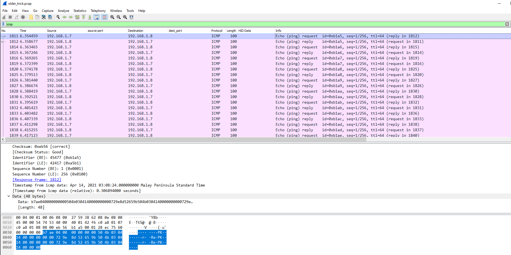

**Description**: A data breach has been identified. The invaders have used the oldest trick in the book. Make sure you can identify what got stolen from us.

**Stars**: 1/5

**Downloadable**:
older_trick.pcap - a pcap file

**Goal**: Get flag from the pcap file

**Solution**: 

At first sight we can see there's plenty of ICMP requests in this pcap file. It smells of ICMP exfiltration.



We can extract data from them with following tshark command `tshark -r older_trick.pcap -Y "icmp && ip.src == 192.168.1.7" -e data.data -Tfields > data.txt`

There seem to be some repeated fragments in the data, it looks like it should be only 32 bytes per packet.

We can decode them to the file with a following python script:

```python
import codecs
f = open("data.txt", "r")
lines = f.readlines()
result = b""

for line in lines:
    result = result + codecs.decode(line[16:48], "hex")

f2 = open("output.bin", "wb")

f2.write(result)
f2.close()
f.close()
```
Looks like it's a zip archive, so let's unpack it:

```bash
$ file output.bin
output.bin: Zip archive data, at least v2.0 to extract
```

It contains folder `fini` which after some consideration looks like exfiltrated user's FireFox data. It apparently contains some encrypted stored passwords in logins.json:

```json
{"nextId":2,"logins":[{"id":1,"hostname":"https://rabbitmq.makelarid.es","httpRealm":null,"formSubmitURL":"https://rabbitmq.makelarid.es","usernameField":"username","passwordField":"password","encryptedUsername":"MDIEEPgAAAAAAAAAAAAAAAAAAAEwFAYIKoZIhvcNAwcECMeab8LuajLlBAixWaWDdSvdNg==","encryptedPassword":"MEoEEPgAAAAAAAAAAAAAAAAAAAEwFAYIKoZIhvcNAwcECGKAhjI0M93wBCDzNVgOAQ9Qn77aRp791mOjsyTjoAINAym/9+wmwdI/hQ==","guid":"{aed76f86-ae6a-4ef5-b413-be3769875b0f}","encType":1,"timeCreated":1618368893810,"timeLastUsed":1618368893810,"timePasswordChanged":1618368893810,"timesUsed":1}],"potentiallyVulnerablePasswords":[],"dismissedBreachAlertsByLoginGUID":{},"version":3}
```

After some googling we can use following tool to decrypt them: https://github.com/lclevy/firepwd

```bash
python3 firepwd/firepwd.py -d fini/
...
decrypting login/password pairs
https://rabbitmq.makelarid.es:b'Frank_B',b'CHTB{long_time_no_s33_icmp}'
```

Voila!
