**Description**: We discovered this tool in the E.T. toolkit which they used to encrypt and exfiltrate files from infected systems. Can you help us recover the files?

**Stars**: 2/5

**Downloadable**:
Alienware.exe - 64 bit C++ binary
Confidential.pdf.alien - encrypted file

**Goal**: To reverse encryption algorithm and decrypt the pdf file with the flag

**Solution**: 

1. After we load the binary to ghidra, we can see that its main function is a bunch of bit operations on string from %OS% environment variable. What's interesting is the call at the end to the address from uninitialized memory:

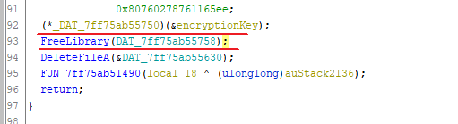

We can see that this memory is uninitialized but there is a referenced from tls_callback, which is interesting (tls callback is a technique that malware uses to hide some code from analyst):

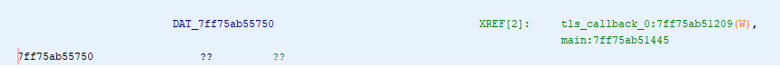

Well, let's take a look. TLS callback indeed looks interesting. It seems that it loads a resource, decrypts it and stores on the disk as xuTaV.dll, later it loads it with LoadLibrary and gets address to exported function "encryptFiles"

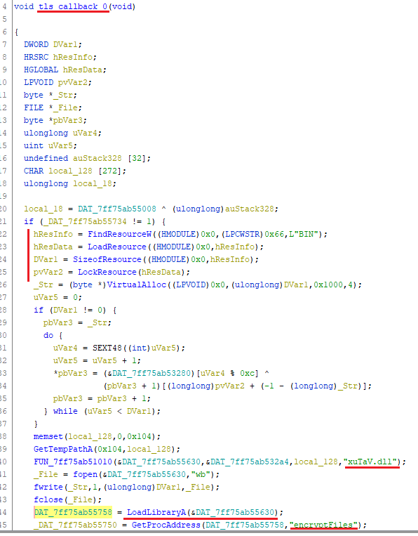

Now we have 2 options, we can dump this binary from the memory (like I did during a challenge, since I didn't analyze tls_callback yet, just saw this reference in debugger), or just grab it from the disk, since it is saved under %TEMP% directory. Just remember that main function removes this file after execution, so you need to pause the binary in the debugger after tls_callback to grab this dll.

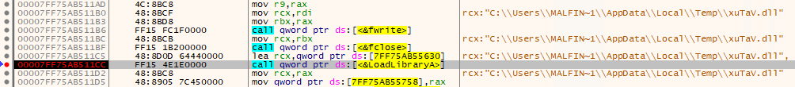

Now let's take a look at this library and it's exported function "encryptFiles". It iterates over files in C:\Users\\%username%\Docs and encrypts them adding extension .alien

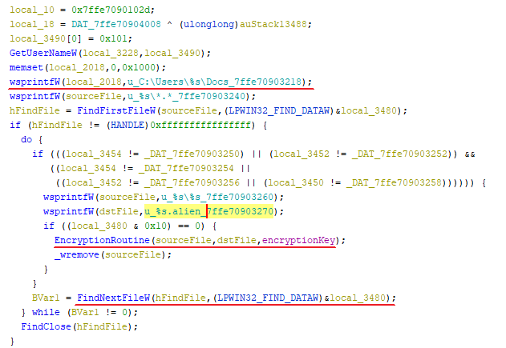

We can actually create C:\Users\\%username%\Docs folder, put there some random files and see they are encrypted after launching our binary.

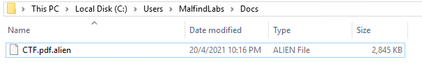

The interesting part is our EncryptionRoutine and key that is passed there. Actually the key is also passed to encryptFiles from main function of Alienware.exe. If we go back there, we will see it is being computed in a huge piece of code with many binary operations, and it is based on %OS% environment variable, as I mentioned before.

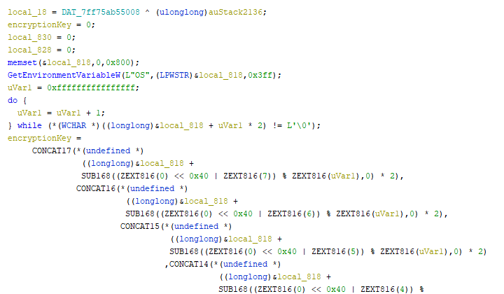

So how do we get the encryption key? Well, we could reverse and reimplement this big chunk of code but it seems like a lot of work. Since we are lazy, we will just grab it from memory. We set the breakpoint on encryptFiles call, and use "Follow [address] in dump" option to see what is being passed to the function. Then simply copy-paste first 16-bytes.

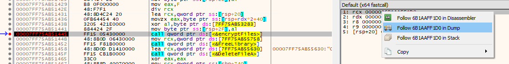

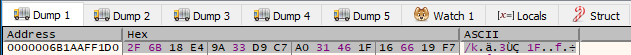

So, we have an encryption key, how do we decrypt the encrypted file? Unfortunately, it seems we need to implement decryption ourselves since Alienware.exe do not have this option in the code (EDIT: as other write-ups pointed out, this is not entirely true, since this is a symmetric encryption algorithm, we could simply patch a call to CryptEncrypt and change it to the call to CryptDecrypt routine, and ransomware should decrypt itself). For this, we need to take a deeper look at EncryptionRoutine in xuTaV.dll.

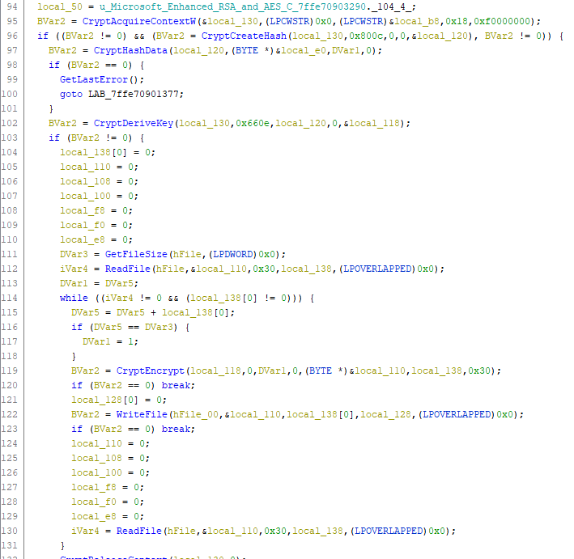

It seems to be using Microsoft Crypto API with AES-256 encryption. It actually took me quite some time to go through Crypto API documentation and understand all the functions and their arguments to implement them in the Decrypter.

Implementation of the decrypter also wasn't easy since I usually don't implement cryptography and especially not in C++ so it took some googling and try & error but I finally managed to get a working code.

I used this example from Microsoft to implement my decrypter: https://docs.microsoft.com/en-us/windows/win32/seccrypto/example-c-program-decrypting-a-file

In fact, I implemented both Crypter and Decrypter for testing purposes (a lot of debugging). Crypter was based on similar example: https://docs.microsoft.com/en-us/windows/win32/seccrypto/example-c-program-encrypting-a-file

Working code can be found in [DecryptFile.cpp](DecryptFile.cpp) (and Crypter code in [EncryptFile.cpp](EncryptFile.cpp))

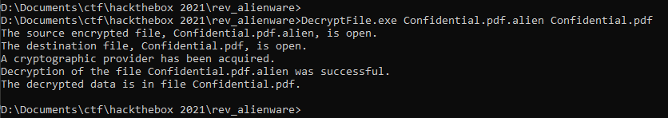

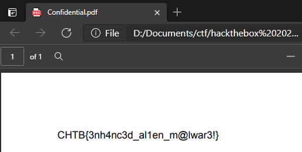

Voila!

I must say I really enjoyed this challenge, it felt really like developing a decrypter for poorly written ransomware and I learned a lot from it. Especially regarding implementing Crypto in C++.
