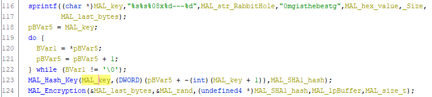
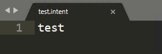
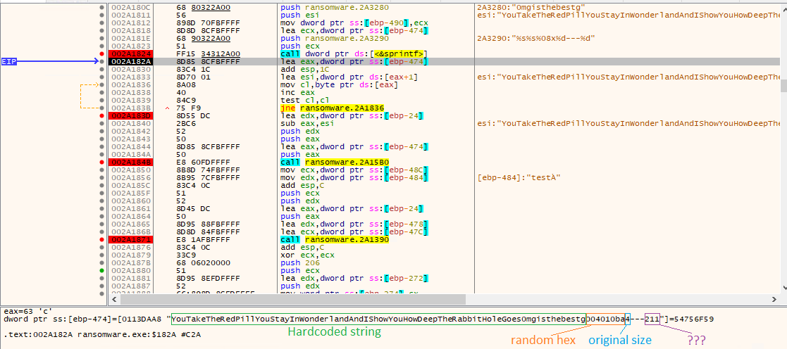
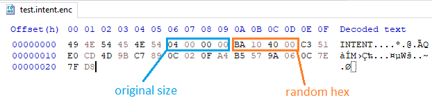
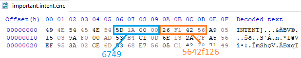
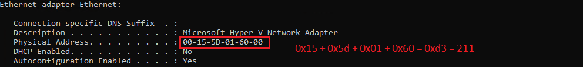
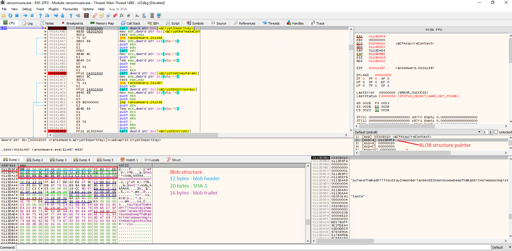
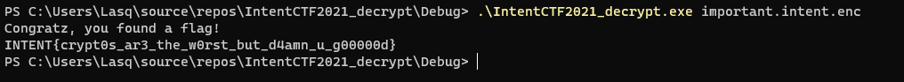

**Description**: Someone hacked my OT network and dropped a ransomware! plz h3lp me recover this encrypted file!

**Points**: 300

**Downloadable**:
ransomware.exe - Ransomware PE32 binary
important.intent.enc - encrypted file

**Goal**: This is a typical "decrypt my ransomware" challenge. We have an encrypted file and a binary encryptor. We must find vulnerability or weakness in encryption implementation, and decrypt the file containing the flag.

**Solution**: 

First, we open ransomware.exe in Ghidra. After making some sense of a code flow we can notice a few things:

1. First some long string is concatenated by using sprintf
2. This string is passed to the function that seems to perform an SHA-1 checksum of it (it calls `CryptCreateHash(local_c,CALG_SHA1,0,0,&local_8);` ). We call it MAL_Hash_Key.
3. SHA-1 hash is passed to the function performing encryption (it calls CryptImportKey and CryptEncrypt). We call it MAL_Encryption.



Our first task is to find a symmetric encryption key. By looking at sprintf declaration, we can see it consists of 5 parts:

`sprintf((char *)MAL_key,"%s%s%08x%d---%d",MAL_str_RabbitHole,"0mgisthebestg",MAL_hex_value,_Size, MAL_last_bytes);`


1. MAL_str_RabbitHole is a hardcoded string: YouTakeTheRedPillYouStayInWonderlandAndIShowYouHowDeepTheRabbitHoleGoes
2. Another hardcoded string: 0mgisthebestg
3. MAL_hex_value seems to be a random hex value based on the size of the original file `srand(_Size)`
4. Is the size of the original encrypted file
5. Is a most mysterious one, if we look at where it comes from, we will see it is a result of some function enumerating local network interfaces.

So how do we find our key? When dealing with such a challenge, it is always good to make a simple test file, that we can encrypt and follow the encryption process along in the debugger. Since this "ransomware" is only encrypting files with extension .intent (security reasons I assume) we will create a file test.intent with a very simple content: test



Now we can launch our encryptor in the debugger and follow along. The first thing we will notice after a call to sprintf is our encryption key:



As expected, we can see there is original file size, some random hex, and number 211 that has something to do with local interfaces.

But how we can recover these values for the originally encrypted file with a flag. Fortunately, our ransomware simply adds these values to the encrypted file:



**Careful, this is in little-endian notation**, so our values for the original file will be as follows:



MAL_hex_value = 5642f126
Size = 0x1a5d = 6749

What about the last number?

After some research we can find out that this number is a sum of bytes for our network interface:



Unfortunately, this value doesn't seem to be stored anywhere by the ransomware binary. The good news is that MAC addresses are 6 bytes long, so that gives us only 0xff * 6 = 1530 different combinations to try. So this should be easily bruteforcable.

Before we create our bruteforce decryptor, we need a little bit more information. CryptImportKey() function takes a `BLOBHEADER structure (wincrypt.h)` as an input. This BLOB structure should normally be the output of the CryptExportKey function but in this case, it is just created directly in the memory. Structure definition can be found in wincrypt.h and here:

[BLOBHEADER structure](https://docs.microsoft.com/en-us/windows/win32/api/wincrypt/ns-wincrypt-publickeystruc)

We could try to recreate the correct structure, or we can take an easy way out and just copy it from the memory of the decryptor. We just need a breakpoint on our CryptImportKey function call:



We can check that our SHA-1 for the test file key is indeed correct:

`sha1(YouTakeTheRedPillYouStayInWonderlandAndIShowYouHowDeepTheRabbitHoleGoes0mgisthebestg004010ba4---211) = ffb057dda0de2f9c59ddd0030a89e097db6f7851`

One more thing we need for our decryption is the IV value. Lucky for us this is just hardcoded in the encryptor:

`lstrcpyA((LPSTR)&MAL_IV,"0010000300003007");`

Having all this information, we can write a decryptor that will bruteforce 1530 key combinations and try to find our flag.

Full code for decryptor is in file `IntentCTF2021_decrypt.cpp` and below this write-up.

Once we compile it and execute it with our originally encrypted file as a parameter, we will have our flag:



```c
// Decrypting_a_File.cpp : Defines the entry point for the console 
// application.
//


#include <tchar.h>
#include <stdio.h>
#include <windows.h>
#include <wincrypt.h>
#include <conio.h>

// Link with the Advapi32.lib file.
#pragma comment (lib, "advapi32")
#pragma warning(disable : 4996)
#pragma warning(disable : 4838)
#pragma warning(disable : 4309)

#define KEYLENGTH  0x00800000
#define ENCRYPT_ALGORITHM CALG_SHA_256 
#define ENCRYPT_BLOCK_SIZE 16 

bool MyDecryptFile(LPTSTR szSource);

void MyHandleError(
    const wchar_t* psz,
    int nErrorNumber);

void EndianSwap(unsigned int& x);

int _tmain(int argc, _TCHAR* argv[])
{
    if (argc < 2)
    {
        _tprintf(TEXT("Usage: <example.exe> <source file> "));
        _tprintf(TEXT("<password> is optional.\n"));
        _tprintf(TEXT("Press any key to exit."));
        _gettch();
        return 1;
    }

    LPTSTR pszSource = argv[1];
    

    //---------------------------------------------------------------
    // Call EncryptFile to do the actual encryption.
    if (MyDecryptFile(pszSource))
    {
        //_tprintf(TEXT("Decryption of the file %s was successful. \n"),pszSource);
    }
    else
    {
        MyHandleError(
            TEXT("Error decrypting file!\n"),
            GetLastError());
    }

    return 0;
}

//-------------------------------------------------------------------
// Code for the function MyDecryptFile called by main.
//-------------------------------------------------------------------
// Parameters passed are:
//  pszSource, the name of the input file, an encrypted file.
bool MyDecryptFile(LPTSTR pszSourceFile)
{
    //---------------------------------------------------------------
    // Declare and initialize local variables.
    DWORD dwKeyBlobLen = 48;
    BYTE blobdata_1[12] = { 0x08, 0x02, 0x00, 0x00, 0x10, 0x66, 0x00, 0x00, 0x20, 0x00, 0x00, 0x00 };
    BYTE blobdata_2[16] = { 0xB9, 0xBA, 0xBB, 0xBC, 0xBD, 0xBE, 0xBF, 0xC0, 0xC1, 0xC2, 0xC3, 0xC4, 0x00, 0x00, 0x00, 0x00 };
    BYTE blob[48] = { 0 };
    BYTE myIV[] = { 0x30, 0x30, 0x31, 0x30, 0x30, 0x30, 0x30, 0x33, 0x30, 0x30, 0x30, 0x30, 0x33, 0x30, 0x30, 0x37 };
    
    bool fReturn = false;
    bool fEOF = false;
    HANDLE hSourceFile = INVALID_HANDLE_VALUE;
    LARGE_INTEGER filesize;
    HCRYPTKEY hKey = NULL;
    HCRYPTHASH hHash = NULL;
    HCRYPTPROV hCryptProv = NULL;
    DWORD dwHashLen;
    DWORD dwHashLenSize = sizeof(DWORD);
    BYTE* pbHash;

    DWORD dwCount;
    PBYTE pbBuffer = NULL;
    PBYTE pbTempBuffer = NULL;
    DWORD dwBlockLen;
    DWORD dwBufferLen;
    PBYTE pbEndOfLine;

    char flag[7] = {0};
    unsigned int * pbOrgSize[4];
    unsigned int * pbHexNum[4];

    dwBlockLen = ENCRYPT_BLOCK_SIZE * 4;
    dwBufferLen = dwBlockLen;

    //---------------------------------------------------------------
        // Open the source file. 
    hSourceFile = CreateFile(
        pszSourceFile,
        FILE_READ_DATA,
        FILE_SHARE_READ,
        NULL,
        OPEN_EXISTING,
        FILE_ATTRIBUTE_NORMAL,
        NULL);
    if (INVALID_HANDLE_VALUE != hSourceFile)
    {
        //_tprintf(TEXT("The source encrypted file, %s, is open. \n"),pszSourceFile);
        // Get File size
        if (!GetFileSizeEx(hSourceFile, &filesize))
        {
            CloseHandle(hSourceFile);
            MyHandleError(
                TEXT("Error calculating file size!\n"),
                GetLastError());
            return false;
        }
    }
    else
    {
        MyHandleError(
            TEXT("Error opening source plaintext file!\n"),
            GetLastError());
        return false;
    }

    // Read flag from source file

    if (!ReadFile(
        hSourceFile,
        flag,
        6,
        &dwCount,
        NULL))
    {
        MyHandleError(
            TEXT("Error reading from source file!\n"),
            GetLastError());
        CloseHandle(hSourceFile);
        return false;
    }

    // Read original file size from source file

    if (!ReadFile(
        hSourceFile,
        pbOrgSize,
        4,
        &dwCount,
        NULL))
    {
        MyHandleError(
            TEXT("Error reading from source file!\n"),
            GetLastError());
        CloseHandle(hSourceFile);
        return false;
    }

    // Read hex number size from source file

    if (!ReadFile(
        hSourceFile,
        pbHexNum,
        4,
        &dwCount,
        NULL))
    {
        MyHandleError(
            TEXT("Error reading from source file!\n"),
            GetLastError());
        CloseHandle(hSourceFile);
        return false;
    }

    // Allocate memory for the file read buffer. 
    if (!(pbBuffer = (PBYTE)malloc(filesize.QuadPart - 14)))
    {
        CloseHandle(hSourceFile);
        MyHandleError(TEXT("Out of memory!\n"), E_OUTOFMEMORY);
        return false;
    }

    if (!(pbTempBuffer = (PBYTE)malloc(filesize.QuadPart - 14)))
    {
        CloseHandle(hSourceFile);
        MyHandleError(TEXT("Out of memory!\n"), E_OUTOFMEMORY);
        return false;
    }

    //Read the encrypted data

    if (!ReadFile(
        hSourceFile,
        pbBuffer,
        filesize.QuadPart - 14,
        &dwCount,
        NULL))
    {
        MyHandleError(
            TEXT("Error reading from source file!\n"),
            GetLastError());
        CloseHandle(hSourceFile);
        return false;
    }

    //---------------------------------------------------------------
    // Get the handle to the default provider. 
    if (CryptAcquireContext(
        &hCryptProv,
        NULL,
        MS_ENH_RSA_AES_PROV,
        PROV_RSA_AES,
        4026531840))
    {
        //_tprintf(TEXT("A cryptographic provider has been acquired. \n"));
    }
    else
    {
        MyHandleError(
            TEXT("Error during CryptAcquireContext!\n"),
            GetLastError());
        //goto Exit_MyDecryptFile;
        return false;
    }

    for (int i = 0; i < 0xFF * 6; i++)
    {
        char keyString[120] = "";
        //--------------------------------------------------------------------
        // Create a hash.
        if (CryptCreateHash(
            hCryptProv,
            CALG_SHA1,
            0,
            0,
            &hHash))
        {
            //printf("An empty hash object has been created. \n");
        }
        else
        {
            MyHandleError(TEXT("Error during CryptCreateHash."), GetLastError());
            return false;
        }

        snprintf(keyString, 120, "YouTakeTheRedPillYouStayInWonderlandAndIShowYouHowDeepTheRabbitHoleGoes0mgisthebestg%08x%d---%d", *pbHexNum, *pbOrgSize, i);
        //printf("%s\n", keyString);

        //--------------------------------------------------------------------
        // Compute SHA-1 from the string.
        if (CryptHashData(
            hHash,
            (BYTE*)keyString,
            strlen(keyString),
            0))
        {
            //printf("Data has been hashed. \n");
        }
        else
        {
            MyHandleError(TEXT("Error during CryptCreateHash."), GetLastError());
            return false;
        }

        // Get hash size

        if (CryptGetHashParam(
            hHash,
            HP_HASHSIZE,
            (BYTE*)&dwHashLen,
            &dwHashLenSize,
            0))
        {
            // It worked. Do nothing.
        }
        else
        {
            MyHandleError(TEXT("CryptGetHashParam failed to get size."), GetLastError());
            return false;
        }

        // initialize memory

        if (pbHash = (BYTE*)malloc(dwHashLen))
        {
            // It worked. Do nothing.
        }
        else
        {
            MyHandleError(TEXT("Out of memory!\n"), E_OUTOFMEMORY);
            return false;
        }

        // Get the hash value

        if (CryptGetHashParam(
            hHash,
            HP_HASHVAL,
            pbHash,
            &dwHashLen,
            0))
        {
            // create blob
            memcpy(blob,blobdata_1,sizeof(blobdata_1));
            memcpy(blob + sizeof(blobdata_1), pbHash, dwHashLen);
            memcpy(blob + sizeof(blobdata_1) + dwHashLen, blobdata_2, sizeof(blobdata_2));

            /*Print the blob.
            for (int j = 0; j < sizeof(blob); j++)
            {
                printf("%02x ", blob[j]);
            }
            printf("\n");*/
        }
        else
        {
            MyHandleError(TEXT("Error during CryptGetHashParam."), GetLastError());
            return false;
        }

        // Import the key BLOB into the CSP. 
        if (!CryptImportKey(
            hCryptProv,
            blob,
            dwKeyBlobLen,
            0,
            0,
            &hKey))
        {
            MyHandleError(
                TEXT("Error during CryptImportKey!/n"),
                GetLastError());
            return false;
        }

        if (!CryptSetKeyParam(
            hKey,
            KP_IV,
            myIV,
            0))
        {
            MyHandleError(
                TEXT("Error during CryptSetKeyParam!/n"),
                GetLastError());
            return false;
        }

        dwCount = dwBlockLen;
        //printf("dwCount: %d\n",dwCount);

        memcpy(pbTempBuffer, pbBuffer, filesize.QuadPart - 14);
        
        /*printf("first bytes: ");
        for (int j = 0; j < 50; j++)
        {
            printf("%02x ", pbTempBuffer[j]);
        }
        printf("\n");*/

        //-----------------------------------------------------------
        // Decrypt the block of data. 
        if (CryptDecrypt(
            hKey,
            0,
            false,
            0,
            pbTempBuffer,
            &dwCount))
        {
            if (memcmp(flag, pbTempBuffer, 6) == 0)
            {
                printf("Congratz, you found a flag!\n");
                pbEndOfLine = (BYTE*)memchr(pbTempBuffer, 10, filesize.QuadPart);
                printf("%.*s\n", pbEndOfLine - pbTempBuffer, pbTempBuffer);
                break;
            }
        }
        else
        {
            MyHandleError(
                TEXT("Error during CryptDecrypt!\n"),
                GetLastError());
            return false;
        }
    }

    return true;
}


//-------------------------------------------------------------------
//  This example uses the function MyHandleError, a simple error
//  handling function, to print an error message to the  
//  standard error (stderr) file and exit the program. 
//  For most applications, replace this function with one 
//  that does more extensive error reporting.

void MyHandleError(const wchar_t* psz, int nErrorNumber)
{
    _ftprintf(stderr, TEXT("An error occurred in the program. \n"));
    _ftprintf(stderr, TEXT("%s\n"), psz);
    _ftprintf(stderr, TEXT("Error number %x.\n"), nErrorNumber);
}
```