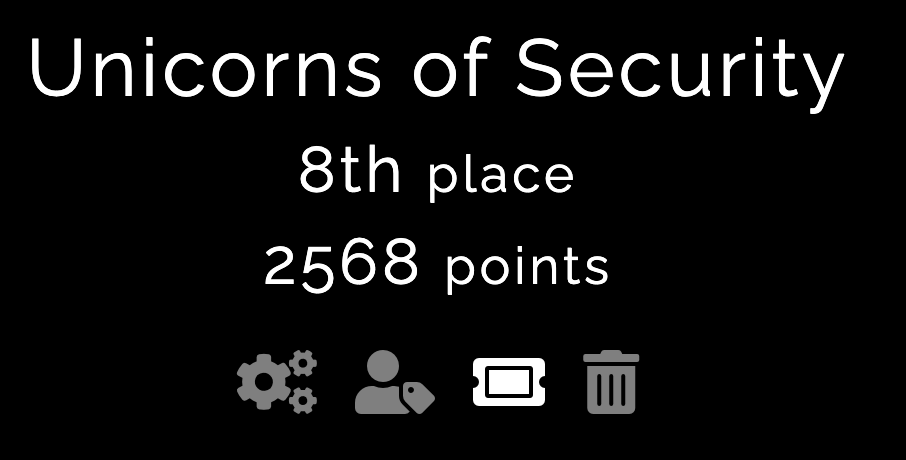

Interesting Polish CTF from Gdańsk University of Technologu student's science club. There were 4 categories: web, crypto, reverse and misc.

We managed to solve multiple challenges end finish on 8th place out of 71 teams

